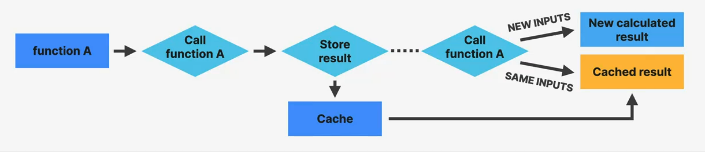
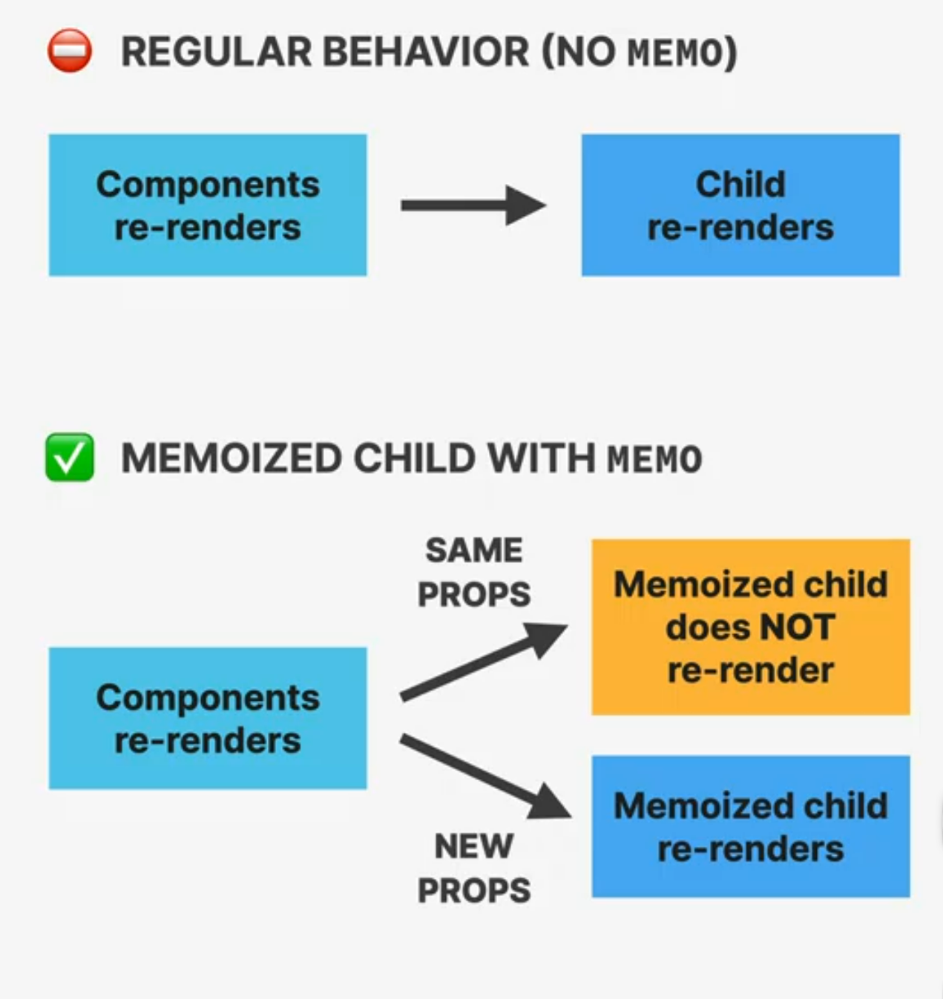
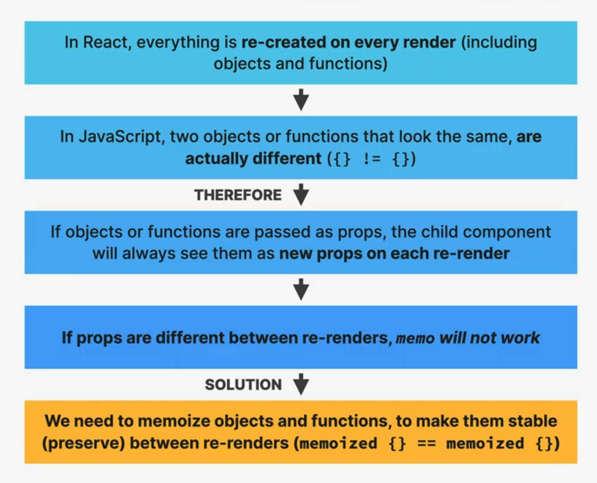
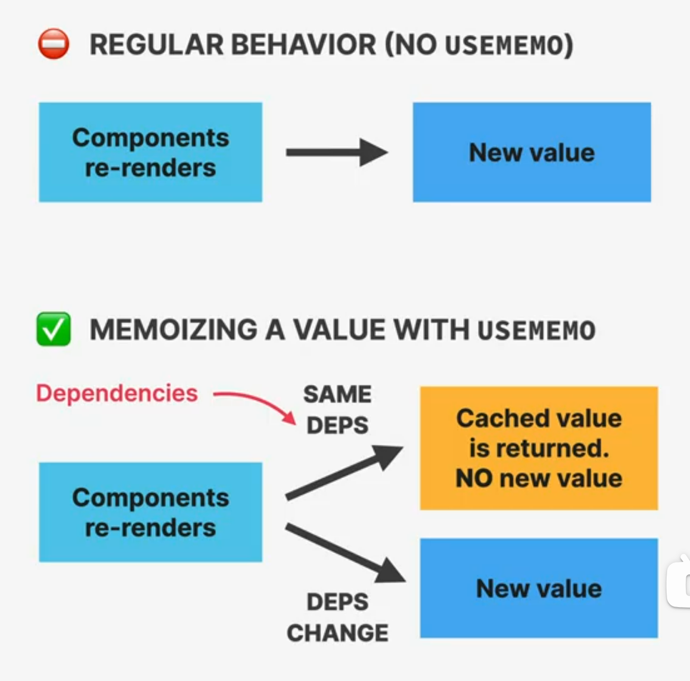

# SECTION-12 PERFORMANCE OPTIMIZATION AND ADVANCED USEEFFECT

## PERFORMANCE OPTIMIZATION TOOLS

1. **PREVENT WASTED RENDERS**
   - 👉 `memo`
   - 👉 `useMemo`
   - 👉 `useCallback`
   - 👉 Passing elements as `children` or regular prop
2. **IMPROVE APP SPEED/RESPONSIVENESS**
   - 👉 `useMemo`
   - 👉 `useCallback`
   - 👉 `useTransition`
3. **REDUCE BUNDLE SIZE**
   - 👉 Using fewer 3rd-party packages
   - 👉 Code splitting and lazy loading

> 👋 This list of tools and techniques is, by no means, exhaustice. You're already doing many optimizations by following the best practices I have been showing you ☝️

## WHEN DOES A COMPONENTS INSTANCE RE-RENDER?

> 👉 A component instance only gets re-rendered in 3 different situations:

1. 🧠 **STATE CHANGES**
2. 🌐 **CONTEXT CHANGES**
3. 🧑‍👩‍🧒 **PARENT RE-RENDERS**
   Creates the false impression that **changing props** re-renders a component. This is **NOT** true.

> 👋 **Remember**: a render does **_not_ mean that the DOM actually gets updated**, it just means the component function gets called. But this can be an expensive operation.
> ⬇️⬇️⬇️
> 👉 **Wasted render**: a render that didn't produce any change in the DOM --Usually no problem, as React is very fast!
> 👉 Only a problem when they happen **too frequently** or when the **component is very slow**

## WHAT IS MEMOIZATION?

> 👉 **Memoization**: Optimization technique that executes a pure function onece, and saves the result in memory. If we try to execute the function again with the **same arguments as before**, the previously saved result will be returned, **without executing the function again**.

- 👉 Memoize **components** with `memo`
- 👉 Memoize **objects** with `useMemo`
- 👉 Memoize **functions** with `useCallback`

1. **Prevent wasted renders**
2. **Improve app speed/responsiveness**

## THE MEMO FUNCTION

### `memo`

- 👉 Used to create a component that will **not re-render when its parent re-renders**, as long as the **props stay the same between renders**
  Memoized component
- 👉 **Only affects props**! A memoized component will still re-render when its **own state changes** or when a **context that it's subscribed to changes**
- 👉 Only makes sense when the component is **heavy**(slow rendering), **re-renders often**, and does so **with the same props**

## AN ISSUE WITH `MEMO`

## TWO NEW HOOKS: USEMEMO AND USECALLBACK

### `useMemo` AND `useCallback`

- 👉 Used to memoize values (**`useMemo`**) and functions (**`useCallback`**) **between renders**
- 👉 Values passed into useMemo and useCallback will be stored in memory ("cached") and r**eturned in subsequent re-renders, as long as dependencies** (_"inputs"_) **stay the same**
- 👉 `useMemo` and `useCallback` have a **dependency array** (like `useEffect`): whenever one **dependency changes**, the value will be **re-created**
- 👉 Only use them for one of the three **use cases**

### THREE BIG USES CASES:

1. Memoizing props to prevent wasted renders (together with `memo`)
2. Memoizing values to avoid expensive re-calculations on every render
3. Memoizing values that are used in dependency array of another hook
   For example to avoid infinite `useEffect` loops
