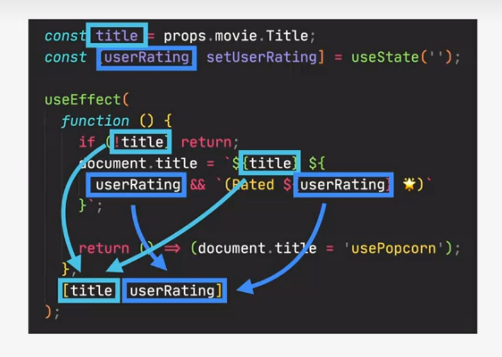
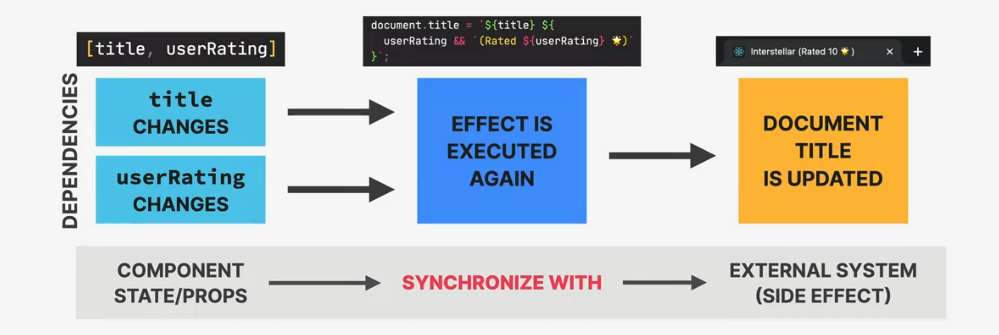
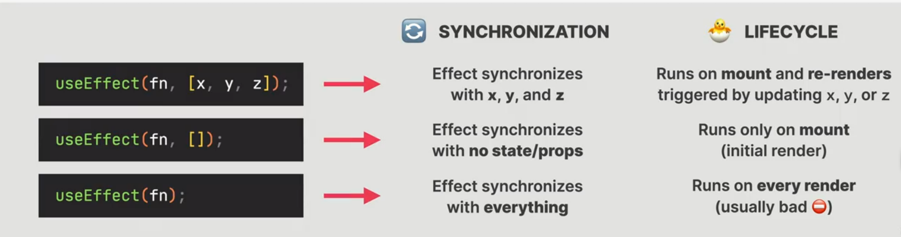
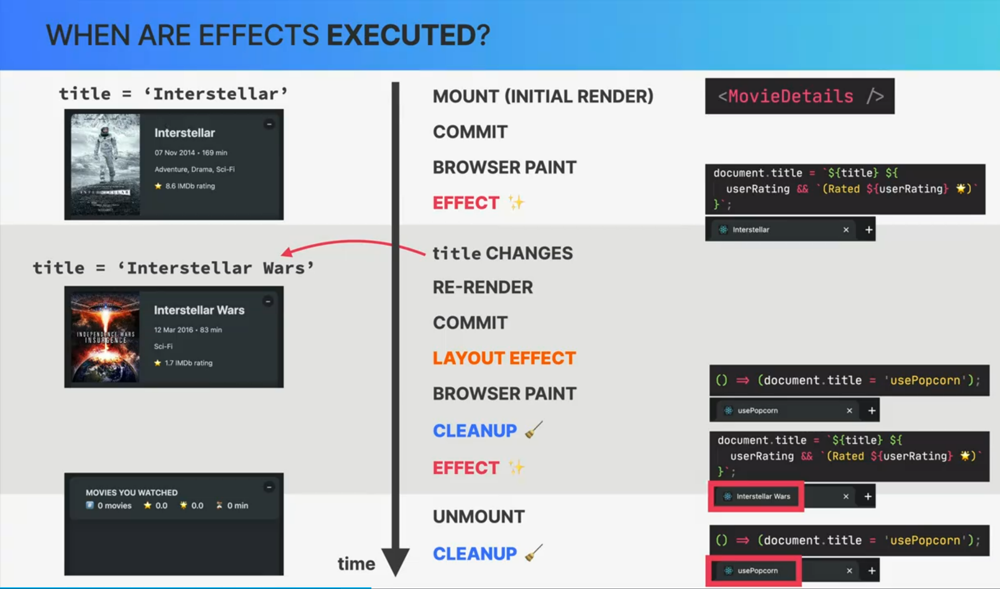

# SECTION 6 EFFECTS AND DATA FETCHING

## COMPONENT (INSTANCE) LIFECYCLE

1. 🐣 MOUNT / INITIAL RENDER

- 👉 Component instance is rendered for the **first time**
- 👉 Fresh state and props are **created**

2. 🐓 RE-RENDER(Optional)

**HAPPENS WHEN**

- 👉 **State** changes
- 👉 **Props** change
- 👉 **Parent** re-renders
- 👉 **Context** changes

3. 💀 UNMOUNT

- 👉 Component instance is **destroyed** and **removed**
- 👉 State and props are **destroyed**
  > We can define code to run at these specific **points in time**

## WHERE TO CREATE SIDE EFFECTS

- **SIDE EFFECT** can be made in...
  > We need side effects all the time. They make our applications do something.
  > **Not** in render logic!
  - **EVENT HANDLERS**
    Triggered by EVENTS: `onClick, onSubmit`, etc.
    > Sometimes this is **not enough** for the application's needs
  - **EFFECTS** (`useEffect`)
    Triggered by RENDERING
    > 👉 Effects allow us to write code that will run at **different moments:** mount, re-render, or unmount

> 👉 **REVIEW:** A **side effect** is basically any "interaction between a React component and the world outside the component". We can also think of a side as "code that actually does something". **Examples:** Data fetching, setting up subscriptions, setting up timers, manually accessing the DOM, etc.

## EVENT HANDLERS VS. EFFECTS

- **EVENT HANDLERS**
  - 👉 Executed when the corresponding event happens
  - 👉 Used to react to an event

> **☝️ Preferred way of creating side effects!**

- **EFFECTS(`useEffect`)**
  - 👉 Executed **after the component mounts** (initial render), and **after subsequent re-renders** (according to dependency array)
  - 👉 Used to keep a component **synchronized with some external system** (in this example with the API movie data)

## WHAT'S THE USEEFFECT DEPENDENCY ARRAY

### THE DEPENDENCY ARRAY

- 👉 By default, effects run **after every render**. We can prevent that by passing a **dependency array**
- 👉 Without the dependency array, React doesn't know **when** to run the effect
- 👉 **_Each time one of the dependencies changes, the effect will be executed again_**
- ☝️ Every **state variable** and **prop** used inside the effect **MUST** be included in the dependency array
  Otherwise, we get a "**stale closure**". We will go more into depth in a future section👉

## USEEFFECT IS A SYNCHRONIZATION MECHANISM

### THE MECHANICS OF EFFECTS

- 👉 `useEffect` is like an **event listener** that is listening for one dependency to change.** Whenever a dependency changes, it will execute the effect again**
- 👉 Effects **react** to updates to state and props used inside the effect (the dependencies). So **effects are "reactive"** (like state updates re-rendering the UI)

## SYNCHRONIZATION AND LIFECYCLE

> **Effects** and **component lifecycle** are deeply connected

- DEPENDENCY (STATE OR PROPS) CHANGES
  - EFFECT IS EXECUTED AGAIN
  - COMPONENT IS RE_RENDERED

> 👉 We can use the dependency array to run effects **when the component renders or re-renders**

## WHEN ARE EFFECTS EXECUTED?

## THE CLEANUP FUNCTION

### USEEFFECT CLEANUP FUNCTION

- 👉 Function that we can **return from an effect** (_optional_)
- 👉 Runs on rwo different occasions:
  1. Before the effect is **executed again**
  2. After a component has **unmounted**
- 👉 Necessary whenever the side effect **keeps happening after the component has been re-rendered or unmounted**
- ☝️ Each effect should do **only one thing!** Use **one `useEffect` hook for each side effect.** This makes effect easier to clean up

COMPONENT **RENDERS** --> Execute effect if **dependency array** includes updated data
COMPONENT **UNMOUNTS** --> Execute **cleanup function**

> Examples
> ✨ **EFFECT** --> 🧹 **POTENTIAL CLEANUP**
>
> - 👉 HTTP request --> Cancel request
> - 👉 API subsription --> Cancel subscription
> - 👉 Start timer --> Stop timer
> - 👉 Add event listener --> Remove listener
