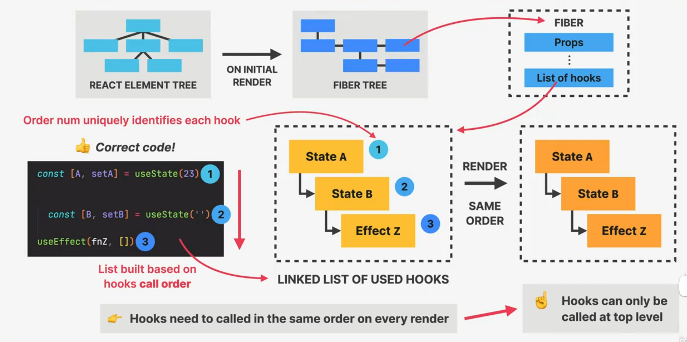
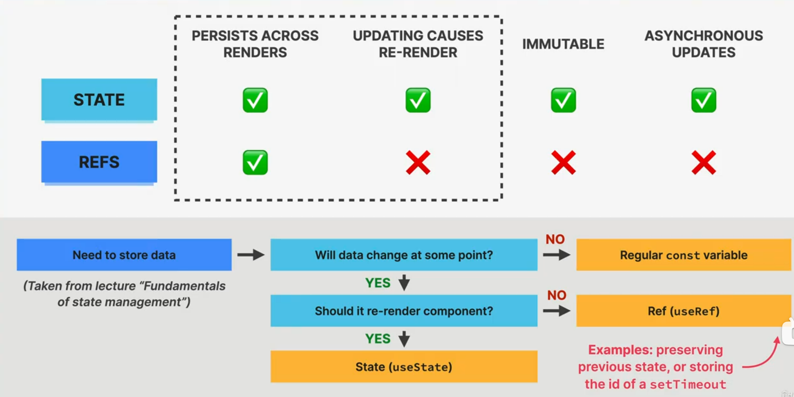

# SECTION-7 CUSTOM HOOKS, REFS, AND MORE STATE

## WHAT ARE REACT HOOKS?

### REACT HOOKS

- 👉 Special built-in functions that allow us to **"hook" into React internals:**
  - 👉 Creating and accessing **state** from Fiber tree
  - 👉 Registering **side effects** in Fiber tree
  - 👉 Manual **DOM selections**
  - 👉 Many more...
- 👉 Always start with "`use`" (`useState`, `useEffect`, etc.)
- 👉 Enable easy **reusing of non-visual logic:** we can compose multiple hooks into our own **custom hooks**
- 👉 Give **function components** the ability to own state and run side effects at different lifecycle points (before v16.8 only availabel in class **components**)

### OVERVIEW OF ALL BUILT-IN HOOKS

> ✔️ Have learned
>
> 👉 Will learn
>
> ❌ Will **not** learn

- 🥇 **MOST USED**
  - ✔️ useState
  - ✔️ useEffect
  - 👉 useReducer
  - 👉 useContext
- 📜 **LESS USED**
  - 👉 useRef
  - 👉 useCallback
  - 👉 useMemo
  - 👉 useTransition
  - 👉 useDeferredValue
  - ❌ useLayoutEffect
  - ❌ useDebugValue
  - ❌ useImperativeHandle
  - ❌ useId
- 🗃️ **ONLY FOR LIBRARIES**
  - ❌ useSyncExternalStore
  - ❌ useInsertionEffect

> 👋 As of React v18.x

### THE RULES OF HOOKS

#### ☝️ RULES OF HOOKS

1.  **Only call hooks at the top level**

    - 👉 Do **NOT** call hooks inside **conditionals, loops, nested functions**, or after an **early return**
    - 👉 This is necessary to ensure that hooks are always called in the **same order** (hooks rely on this)

2.  **Only call hooks fromReact functions**

    - 👉 Only call hooks inside a **function component** or a **custom hook**

> 👋 These rules are **automatically enforced** by React's ESLint rules

### HOOKS RELY ON CALL ORDER



## SUMMARY OF DEFINING AND UPDATING STATE

1. **CREATING** STATE

- Simple -- const [count,setCount] = useState(23)
- Based on **function** (lazy evaluation) -- const [count, setCount] = useState(() => localStorage.getItem('count'))
  👉 Function must be **pure** and accept **no arguments**. Called only on **initial render**

2. **UPDATING** STATE
   > Make sure to **NOT** mutate objects or arrays, but to **replace** them

- Simple -- setCount(1000)
- Based on current state -- setCount((c) => c + 1)
  👉 Function must be **pure** and return next state

## WHAT ARE REFS?

### REF WITH useRef

- 👉 "Box" (object) with a **mutable** .`current` property that is **persisted across renders** ("normal" variables are always reset)
- 👉 Two big use cases:
  1. Creating a variable that stays the same between renders (e.g. previous state, `setTimeout` id, etc.)
  2. Selecting and storing DOM elements
- 👉 Refs are for **data that is NOT rendered**: usually only appear in event handlers or effects, not in JSX (otherwise use state)
- ☝️ Do **NOT** read write or read .`current` in render logic (like state)

> We can write and read from the ref using .`current`

### STATE VS. REFS



## REUSING LOGIC WITH CUSTOM HOOKS

👉 _"I need to reuse:"_

- **UI**
  - COMPONENT
- **LOGIC**
  - Does logic contain any **hooks**?
    - **NO** --> REGULAR FUNCTION
    - **YES** --> CUSTOM HOOK

> - 👉 Allow us to reuse **non-visual logic** in multiple components
> - 👉 One custom hook should have **one purpose**, to make it **reusable** and **protable** (even across multiple projects)
> - 👉 **Rules of hooks** apply to custom hooks too

```JSX
function useFetch(url) {
  const [data, setData] = useState([]);
  const [isLoading, setIsLoading] = useState(false);

  useEffect(function () {
    fetch(url)
      .then((res) => res.json())
      .then((res) => setData(res));
  }, []);

  // Unlike components, can receive and return any relevant data (usually [] or {})
  return [data, isLoading]
}
```
