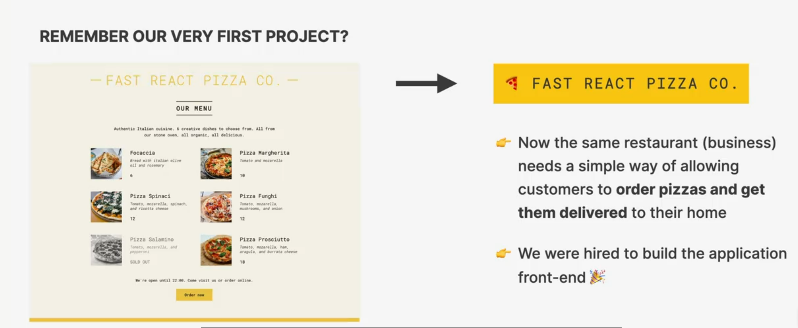
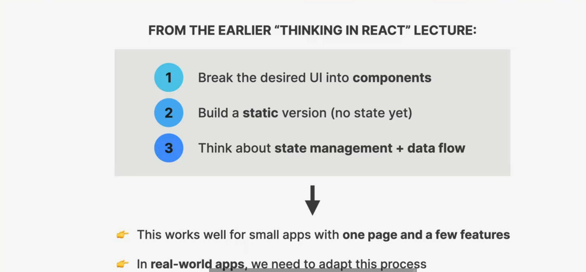
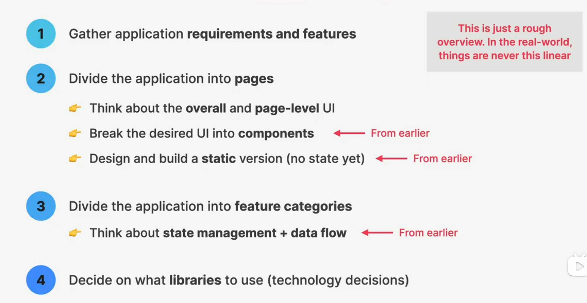
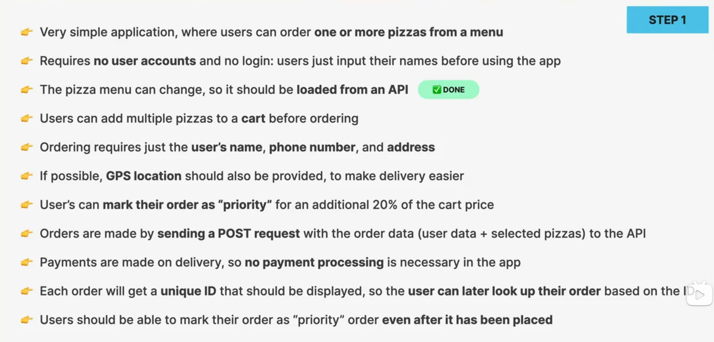
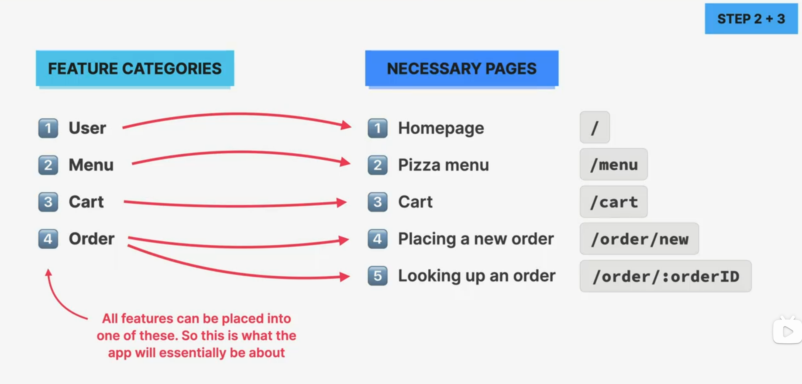
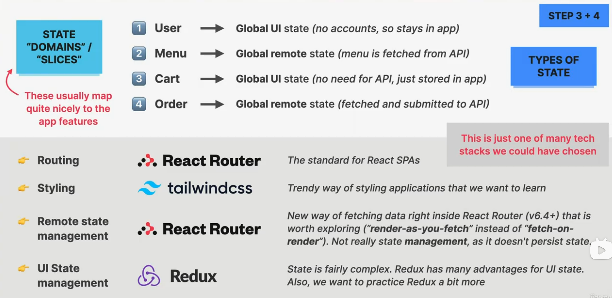
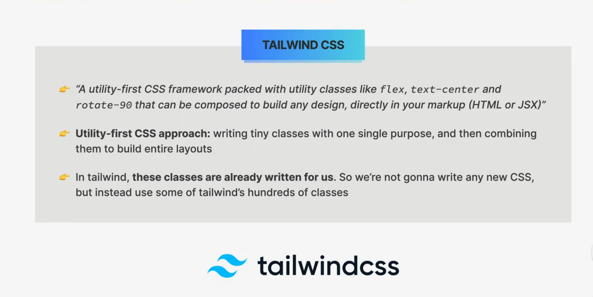
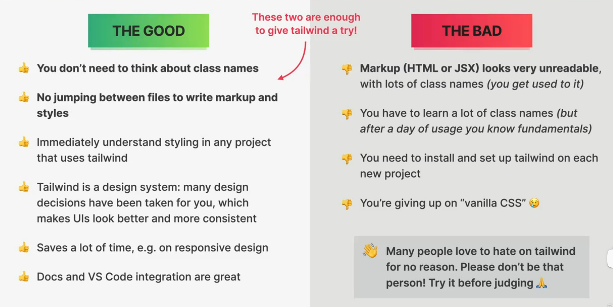

# SECTION-14 REACT ROUTER WITH DATA LOADING(V6.4+)

## THE PROJECT: 🍕 FAST REACT PIZZA CO.

## HOW TO PLAN AND BUILD A REACT APPLICATION

## PROJECT REQUIREMENTS FROM THE BUSINESS

### STEP 1

> From these requirements, we can understande the features we need to implement

### STEP 2 + 3

### STEP 3 + 4

## WHAT IS TAILWIND CSS?

## THE GOOD AND BAD ABOUT TAILWIND

