# SECTION-5 HOW REACT WORKS BEHIND THE SCENES

## COMPONENT VS. INSTANCE VS. ELEMENT

> Component -> Component Instance --returns--> React Element --Inserted to DOM--> DOM Element(html)

### Component

- 👉 **Description** of a piece of UI
- 👉 A component is a function that **returns React elements** (element tree), usually written as JSX
- 👉 "Blueprint" or "Template"

### Component Instance

- 👉 Instances are created when we **"use"** components
- 👉 React internally calls Tab()
- 👉 Actual **"physical" manifestation** of a component
- 👉 Has its own state and props
- 👉 Has a **lifecycle** (can "be born", "live", and "die")

### React Element

- 👉 JSX converted to `React.createElement()` **function calls**
- 👉 A React element is the **result of these function calls**
- 👉 Information necessary to create **DOM elements**

### DOM Element(HTML)

- 👉 Actual **visual representation** of the component instance in the browser

### QUICK RECAP BEFORE WE GET STARTED

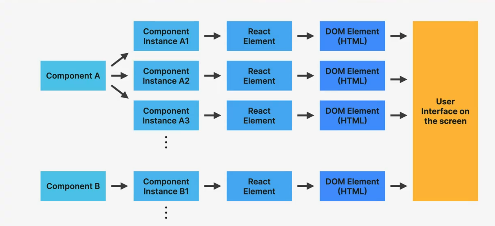

> Q: 🤔 How does this process actually work?

## OVERVIEW: HOW COMPONENTS ARE DISPLAYED ON THE SCREEN

1. RENDER IS TRIGGERED
   By updating state somewhere

2. RENDER PHASE
   React **calls component functions** and figures out **how** DOM should be updated

3. COMMIT PHASE
   React **actually writes to the DOM**, updating, inseting, and deleting elements

> 2&3 -> Common sense meaning of the word "render"

4. BROWSER PAINT

## HOW RENDERS ARE TRIGGERED

[1] **RENDER IS TRIGGERED**

> THE TWO SITUATIONS THAT TRIGGER RENDERS:
>
> 1. **Initial render** of the application
> 2. **State is updated** in one or more component instances (**re-render**)

- 👉 The render process is triggered for the **entire application**
- 👉 **In practice**, it looks like React only re-renders the component where the state update happens, but that's not how it **works behind the scenes**
- 👉 Renders are **not** triggered immediately, but **scheduled** for when the JS engine has some "free time". There is also batching of multiple `setState` calls in event handlers

## REVIEWL: THE MECHANICS OF STATE IN REACT

- NOT TRUE #1: RENDERING IS UPDATING THE SCREEN / DOM
- NOT TRUE #2: REACT COMPLETELY DISCARDS OLD VIEW (DOM) ON RE-RENDER

## THE RENDER PHASE

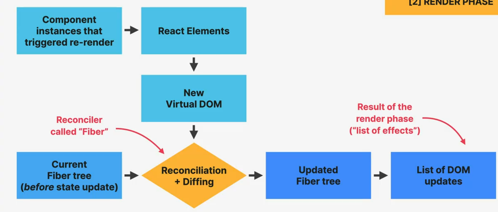

[2] **RENDER PHASE**

### THE VIRTUAL DOM (REACT ELEMENT TREE)

**1️⃣ INITIAL RENDER ---> 🔁 RE-RENDERS**

- 👉 **Virtual DOM:** Tree of all React elements created from all instances in the component tree
- 👉 Cheap and fast to create multiple trees
- 👉 Nothing to do with "shadow DOM"

🚨 Rendering a component will **cause all of its child components to be rendered as well** (no matter if props changed or not)
⬇️⬇️⬇️⬇️⬇️⬇️⬇️⬇️
Necessary because React doesn't know whether children will be affected

### WHAT IS RECONCILIATION AND WHY DO WE NEED IT?

> 🤔 Why not update the entire DOM whenever state changes somewhere in the app?

Because...

- 👉 That would be inefficient and wasteful:
  1. Writing to the DOM is (relatively) **slow**
  2. Usually only a **small part of the DOM** needs to be updated
- 👉 React **reuses** as much of the existing DOM as possible

How?...

> ❤️ **Reconciliation:** Deciding which DOM elements actually need to be inserted, deleted, or updated, in order to reflect the latest state changes

## THE RECONCILER: FIBER

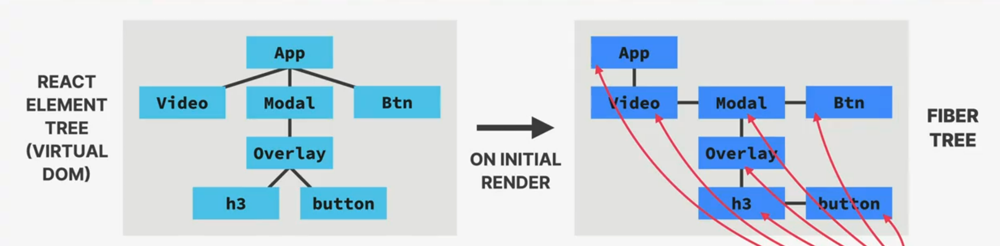

- 👉 **Fiber tree:** internal tree that has a "fiber" for each component instance and DOM element
- 👉 Fibers are **NOT** re-created on every render
- 👉 Work can be done asynchronously

> - 👉 Rendering process can be split into chunks, tasks can be prioritized, and work can be **paused**, **reused**, or **thrown away**
>   - 👉 Enables **concurrent features** like `Suspense` or transitions
>   - 👉 Long renders **won't block** JS engine

- **FIBER**
  - "Unit of work"
  - Current state
  - Props
  - Side effects
  - Queue of work

## RECONCILIATION IN ACTION

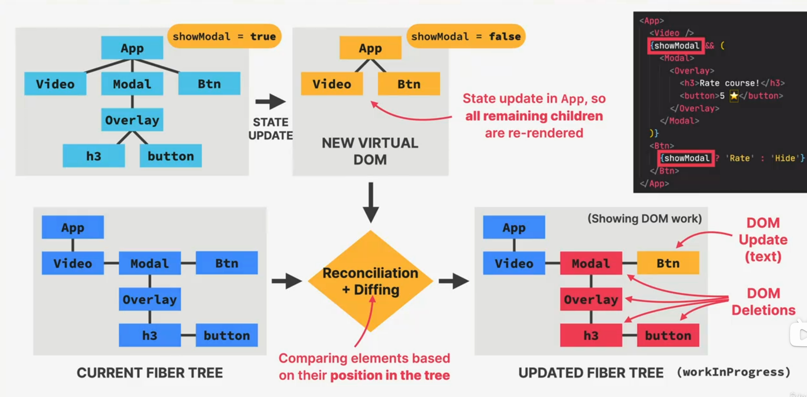

### THE COMMIT PHASE AND BROWSER PAINT

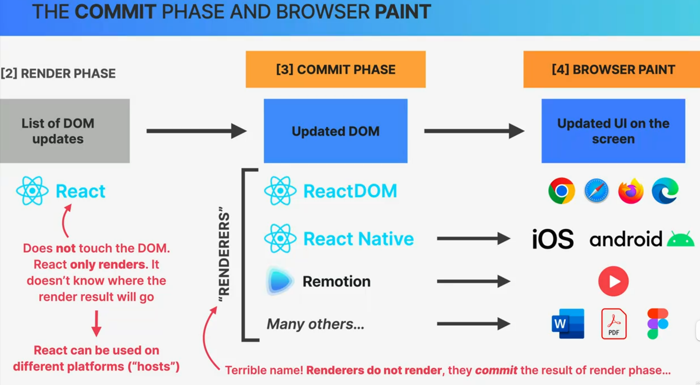

- 👉 **React writes to the DOM**: insertions, deletions, and updates (list of DOM updates are "flushed" to the DOM)
- 👉 **Committing is synchronous**: DOM is updated in one go, it can't be interrupted. This is necessary so that DOM never shows partial results, ensuring a consistent UI (in sync with state at all times)
- 👉 After the commit phase completes, the `workInProgress` fiber tree becomes `current` tree **for the next render cycle**

## RECAP: PUTTING IT ALL TOGETHER

- [1] **TRIGGER 💥**
  - 👉 Happens **only** on initial render and state updates
- [2] **RENDER PHASE**
  > - 👉 Does not produce any visual output
  > - 👉 Rendering a component also renders all of its child components
  > - 👉 Asynchronous: work can be split, prioritized, paused, resumed
  > - 👉 Synchronous: DOM updates are written in one go, to keep UI consistent
  - Updated React Elements ➡️ New Virtual DOM ⬇️
  - Current Fiber tree ➡️ Reconciliation + Diffing
  - ⬇️➡️ Updated Fiber tree ➡️ List of DOM updates
- [3] COMMIT PHASE
  - ⬇️➡️ Updated DOM
- [4] BROWSER PAINT
  - ⬇️➡️ Updated UI on screen

## THE RENDER PHASE

### HOW DIFFING WORKS

- 👉 **Diffing uses 2 fundamental assumptions (rules):**
  1.  Two elements of different types will **produce different trees**
  2.  Elements with a stable `key` prop **stay the same across renders**
- 👉 This allows React to go from **1,000,000,000**[O(n³)] to **1000** [O(n)] operations per 1000 elements

## WHAT IS THE KEY PROP?

> **KEY PROP**

- 👉 Special prop that we use to tell the diffing algorithm that an element is **unique**
- 👉 Allows React to **distinguish** between multiple instances of the same component type
- 👉 When a key **stays the same across renders**, the element will be kept in the DOM (even if the position in the tree changes)
  1.  **_Using keys in lists_**
- 👉 When a key **changes between renders**, the element will be destroyed and a new one will be created (even if the position in the tree is the same as before)  
  2. **_Using keys to reset state_**

### 1. KEYS IN LISTS [STABLE KEY]

- 👎 **NO KEYS**

```JSX
   <ul>
      <Question question={q[1]} />
      <Question question={q[2]} />
   </ul>
   // ⬇️ ADDING NEW LIST ITEM
   <ul>
      <Question question={q[0]} />
      <Question question={q[1]} />
      <Question question={q[2]} />
   </ul>
```

      - 👉 Same elements, but **different position in tree**, so they are removed and recreated in the DOM (_bad for performance_)

- 👍 **WITH KEYS**

```JSX
   <ul>
      <Question key='q1' question={q[1]} />
      <Question key='q2' question={q[2]} />
   </ul>
   // ⬇️ ADDING NEW LIST ITEM
   <ul>
      <Question key='q0' question={q[0]} />
      <Question key='q1' question={q[1]} />
      <Question key='q2' question={q[2]} />
   </ul>
```

      - 👉 **Different position in the tree**, but the key **stays the same**, so the elements will be kept in the DOM.  👉 Always use keys!

### 2. KEY PROP TO RESET STATE [CHANGING KEY]

👍 **WITH KEY**

> 👉 If we have the same element at the same position in the tree, the **DOM element and state** will be kept

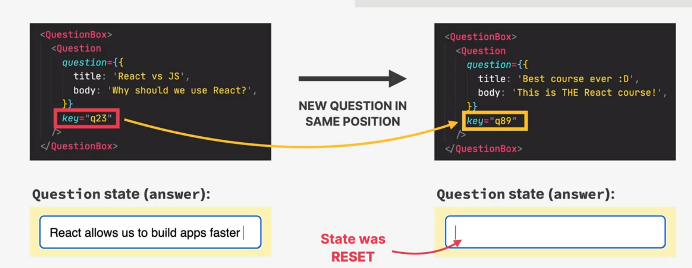

## THE TWO TYPES OF LOGIC IN REACT COMPONENTS

1. **RENDER LOGIC**
   - 👉 Code that lives at the **top level** of the component function
   - 👉 Participates in **describing** how the component view looks like
   - 👉 Executed **every time** the component renders
2. **EVENT HANDLER FUNCTIONS**
   - 👉 Executed as a **consequence of the event** that the handler is listening for (`change` event in this example)
   - 👉 Code that actually **_does things_**: update state, perform an HTTP request, read an input field, navigate to another page, etc.

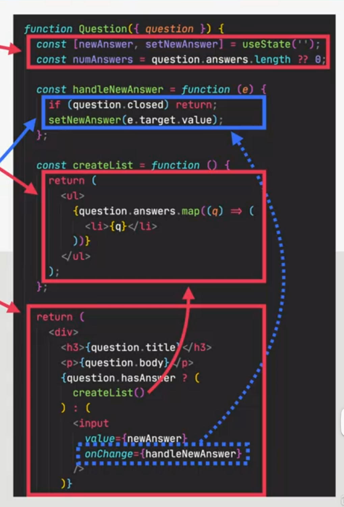

## REFRESHER: FUNCTIONAL PROGRAMMING

- 👉 **Side effectL:** dependency on or modification of any data outside the function scope. "**_Interaction with the outside world_**". **Examples:** mutating external variables, HTTP requests, writing to DOM.

  > 👋 **Side effects are not bad!** A program can only be useful if it has some interaction with the outside world

- 👉 **Pure function:** a function that has **no** side effects.
  - 👉 Does **not** change any variables outside its scope
  - 👉 Given the **same input**, a pure function always returns the **same output**

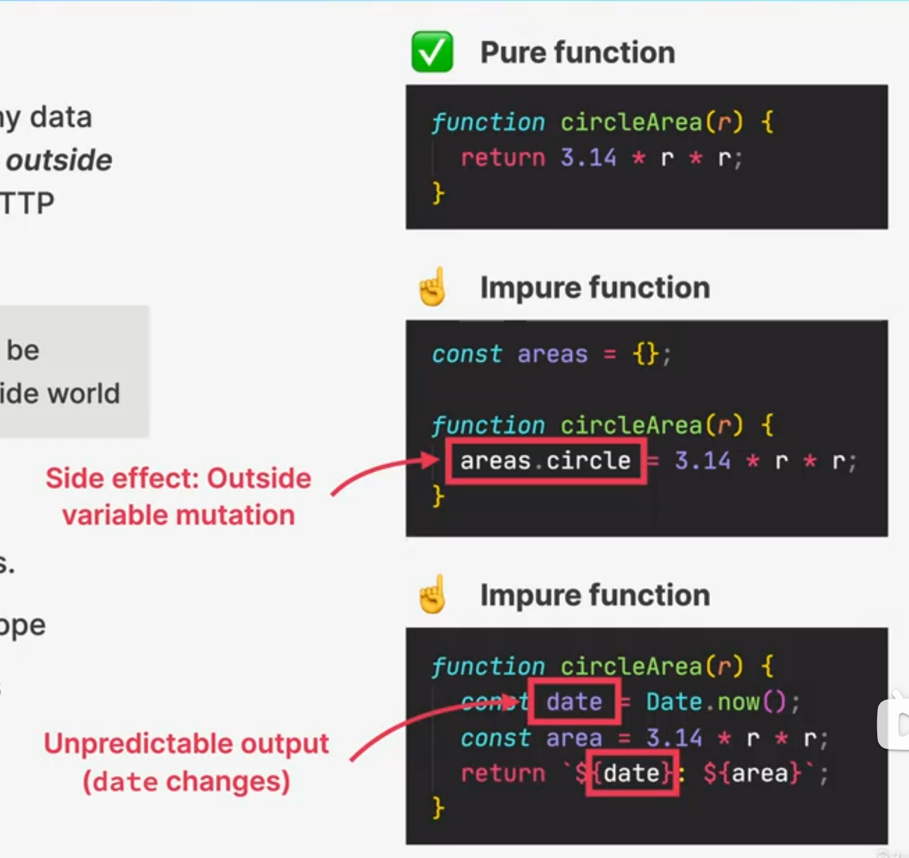

## RULES FOR RENDER LOGIC

- ☝️ **Components must be pure when it comes to render logic**: given the same props (input), a component instance should always return the same JSX (output)
- ☝️ **Render logic must produce no side effects**: no interaction with the "outsideworld" is allowed. So, in render logic:
  - 👉 Do NOT perform **network requests** (APl calls)
  - 👉 Do NOT start **timers**
  - 👉 Do NOT directly **use the DOM API**
  - 👉 Do NOT **mutate objects or variables** outside of the function scope
    > This is why we can't mutate props!
  - 👉 Do NOT **update state (or refs):** this will create an infinite loop!

> 👋 Side effects are allowed (and encouraged) in **event handler functions!** There is also a special hook to **register side effects** (`useEffect`)

## UPDATING STATE IS ASYNCHRONOUS

**EVENT HANDLER FUNCTION**

```JSX
const reset = function() {
   setAnswer('')
   console.log(answer) // 🤔 What will the value of `answer` be at this point
   setAnswer(true)
   setAnswer(false)
}
```

- 👉 Updated state variables are **not** immediately available after `setState` call, but only after the re-render
- 👉 This also applies when **only one** state variable is updated
- 👉 If we need to update state **based on previous update**, we use `setState` with callback (`setAnswer( answer => ...)`)

1. State is stored in the Fiber tree during **render phase**
2. At this point, re-render has **not happend yet**
3. Therefore, **anwser** still contains **current state, not** the updated state('')
4. **UPDATING STATE IN REACT IS ASYNCHRONOUS**

## BATCHING BEYOND EVENT HANDLER FUNCTIONS

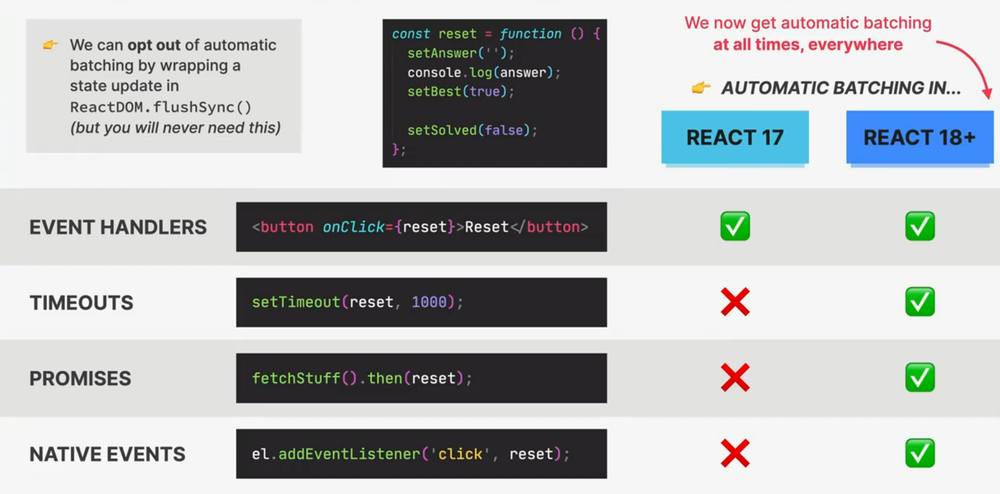

## DOM REFRESHER: EVENT PROPAGATION AND DELEGATION

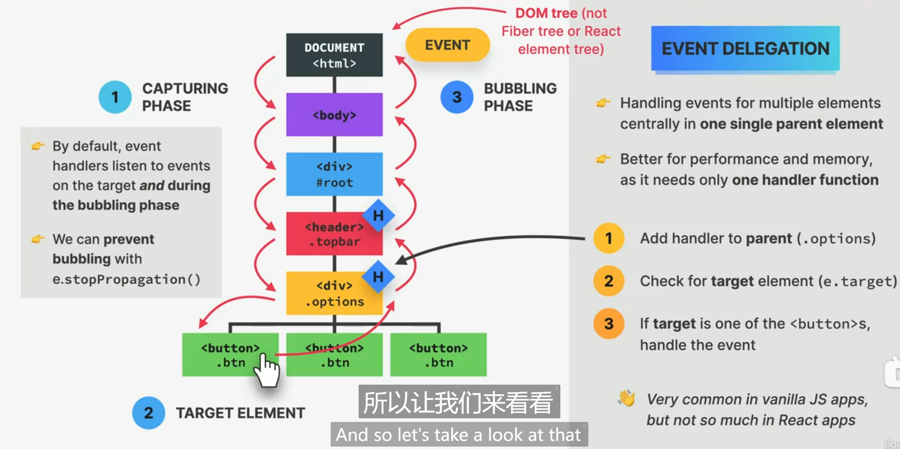

## HOW REACT HANDLES EVENTS

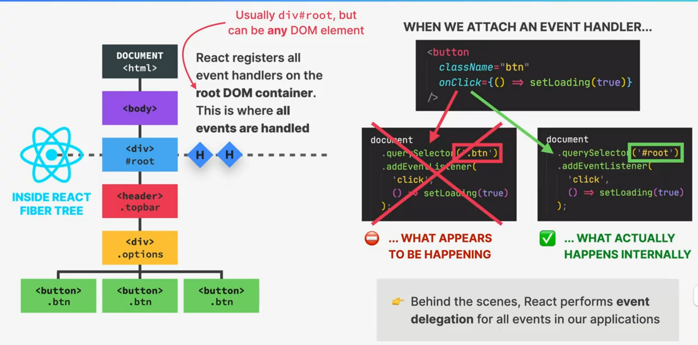

## SYNTHETIC EVENTS

- 👉 Wrapper around the DOM's native event object
- 👉 Has **same interface** as native event objects, like `stopPropagation()` and `preventDefault()`
- 👉 Fixes browser inconsistencies, so that events work in the exact **same way in all browsers**
- 👉 **Most synthetic events bubble** (including focus, blur, and change), except for scroll

### EVENT HANDLERS IN REACT VS. JS

- 👉 Attributes for event handlers are named using **camelCase** (`onClick` instead of `onclick` or `click`)
- 👉 Default behavior can **not** be prevented by returning `false` (only by using `preventDefault()`)
- 👉 Attach "`Capture`" if you need to handle during **capture phase** (example: `onClickCapture`)

## FRAMEWORK VS. LIBRARY

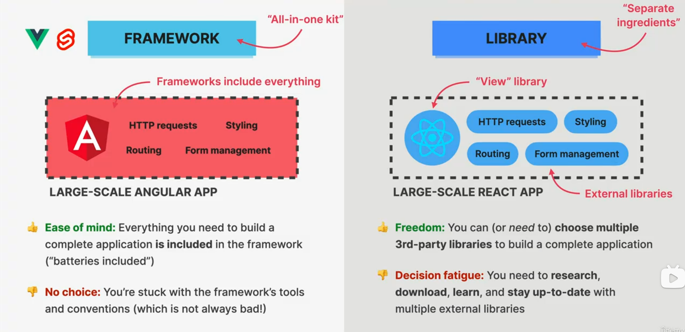

### REACT 3RD-PARTY LIBRARY ECOSYSTEM

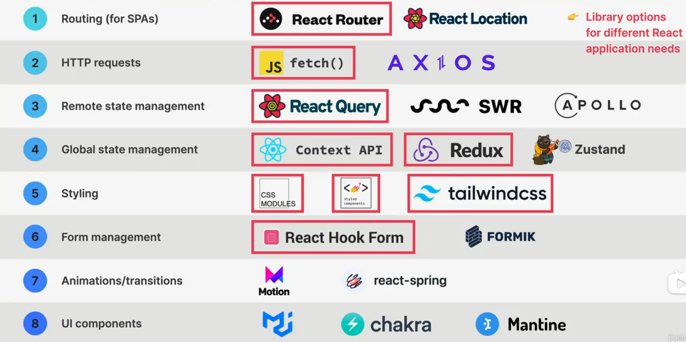

### FRAMEWORK BUILT ON TOP OF REACT

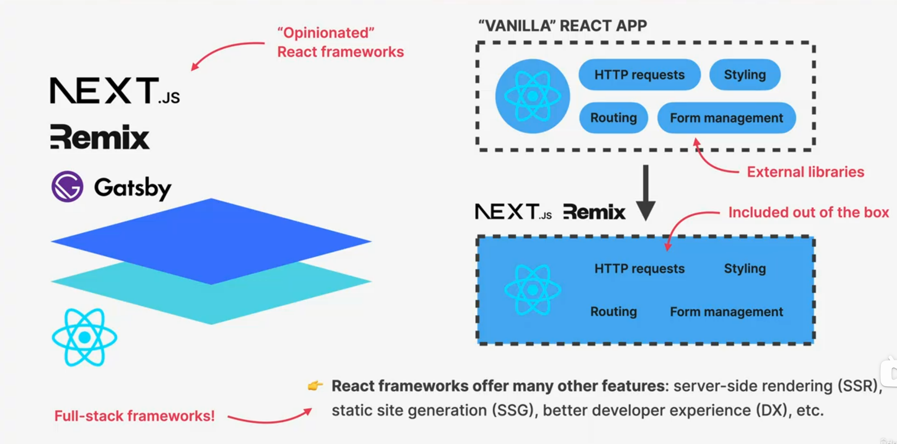

## 🎯 PRACTICAL SUMMARY

- 🧩 A **component** is like a blueprint for a piece of Ul that will eventually exist on the screen. When we"use" a component, React creates a** component instance**, which is like an actual physical manifestation of a component, containing props, state, and more. A component instance, when rendered, will return a **React element**
- ☎️ "Rendering" only means **calling component functions** and calculating what DOM elements need to be inserted, deleted, or updated. lt has nothing to do with writing to the DOM. Therefore, **each time a component instance is rendered and re-rendered, the function is called again**
- 🔁 Only the **initial app render** and **state updates** can cause a render, which happens for the **entire application**, not just one single component
- 🧑‍👩‍🧒 When a component instance gets re-rendered, **all its children will get re-rendered as wel**. This doesn't mean that all children wil get updated in the DOM, thanks to reconciliation, which checks which elements have actually changed between two renders. But all this re-rendering can still have an impact on performance (more on that later in the course👉)
- 🧬 Diffing is how React decides which DOM elements need to be added or modified. If, between renders, a certain React element **stays at the same position in the element tree**, the corresponding DOM element and component state will stay the same. If the element **changed to a different position**, or if it's a **different element type**, the DOM element and state will be destroyed
- 🔑 Giving elements a key prop allows React to distinguish between multiple component instances. **When a key stays the same across renders**, the element is kept in the DOM. This is why we need to use keys in lists. **When we change the key between renders**, the DOM element will be destroyed and rebuilt. We use this as a **trick to reset state**
- 🪆 **Never declare a new component inside another component!** Doing so will re-create the nested component every time the parent component re-renders. React will alwavs see the nested component as **new**, and therefore **reset its state** each time the parent state is updated
- 🔮 The logic that produces JSX output for a component instance ("render logic") is **not allowed to produce any side effects**: no API calls, no timers, no object or variable mutations, no state updates, **Side effects are allowed in event handlers** and **useEffect** (next section 👉)
- 📱 The DOM is updated in the commit phase, **but not by React, but by a "renderer" called ReactDOM.** That's why we always need to include both libraries in a React web app project. We can use other renderers to use React on different platforms, for example to build mobile or native apps
- 🗂️ Multiple state updates inside an event handler function are **batched**, so they happen all at once, **causing only one re-render**. This means we can **not access a state variable immediately after updating it**: state updates are **asynchronous**, Since React 18, batching also happens in timeouts, promises, and native event handlers.
- 🌐 When using events in event handlers, we get access to a **synthetic event object**, not the browser's native object, so that **events work the same way across all browsers**, The difference isthat **most synthetic events bubble**, including focus, blur, and change, which do not bubble asnative browser events. Only the scroll event does not bubble
- 🛠️ **React is a library, not a framework**. This means that you can assemble your application using your favorite third-party libraries, The downside is that you need to find and learn all these additional libraries. No problem, as you will learn about the most commonly used libraries in this course
