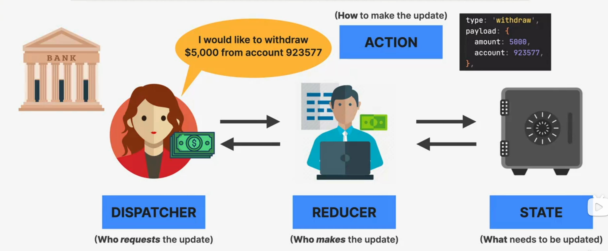
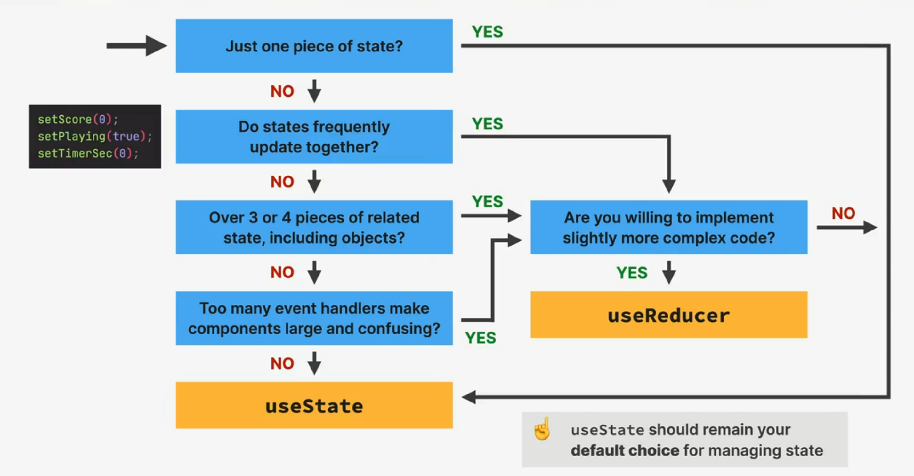

# SECTION-9 THE ADVANCED USEREDUCER HOOK

## WHY USEREDUCER?

- 👉 **STATE MANAGEMENT WITH `useState` IS NOT ENOUGH IN CERTAIN SITUATIONS:**

  1. When components have **a lot of state variables and state updates**, spread across many event handlers **all over the component**
  2. When **multiple state updates** need to happen **at the same time** (as a reaction to the same event, like "staring a game")
  3. When updating one piece of state **depends on one or multiple other pieces of state**

- 👉 **IN ALL THESE SITUATIONS `useReducer` CAN BE OF GREAT HELP**

## MANAGING STATE WITH USEREDUCER

### STATE WITH `useReducer`

- 👉 An alternatice way of setting state, ideal for **complex state** and **related pieces of state**
- 👉 Stores related pieces of state in a **state** object
- 👉 `useReducer` needs **reducer**: function containing **all logic tp update state. Decouples state logic**
  > reducer like `setState()` with superpowers
- 👉 **`reducer`**: pure function (**_no side effects!_**) that takes current `state` and `action`, **and returns the next state**
- 👉 **`action`**: object that describes **how to update state**
- 👉 **`dispatch`**: function to trigger state updates, by **"sending" actions** from **event handlers** to the **`reducer`**
  > "sending" actions instead of `setState()`

## HOW REDUCERS UPDATE STATE

### useReducer

**👉 Updating state in a component**
⬇️⬇️⬇️

- `dispatch`
- `reducer` -CURRENT STATE -`action`
  > Why reducer is called "reducer"?
  > Just like `array.reduce()`, reducers accumulate("reduce") **actions over time**
- NEXT STATE
- RE-RENDER

### useState

- setState -UPDATED STATE
- NEXT (UPDATED) STATE
- RE-RENDER

## A MENTAL MODEL FOR REDUCERS

> 👉 REAL-WORLD TASK: WITHDRAWING $5,000 FROM YOUR BANK ACCOUNT

## USESTATE VS. USEREDUCER

### useState

- 👉 Ideal for **single, independent pieces of state** (numbers, strings, single arrays, etc.)
- 👉 Logic to update state is placed directly in event handlers or effects, **spread all over one or multiple components**
- 👉 State is updated by **calling `setState`** (setter returned from `useState`)
- 👉 **Imperative** state updates
- 👉 **Easy** to understand and to use

### useReducer

- 👉 Ideal for multiple **related pieces of state** and **complex state** (e.g. object with many values and nested objects or arrays)
- 👉 Logic to update state lives in **one central place, decoupled from components**: the reducer
- 👉 State is updated by **dispatching an action** to a reducer
- 👉 **Declaratice** state updates: complex state transitions are **mapped** to actions
- 👉 More **difficult** to understand and implement

## WHEN TO USE USEREDUCER?

