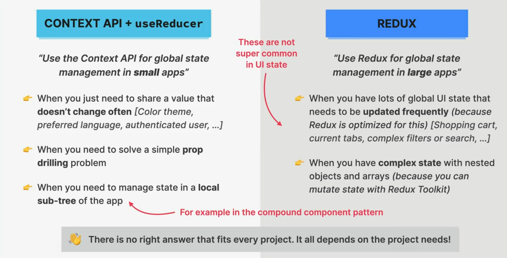

# SECTION-13 REDUX AND MODERN REDUX TOOLKIT (WITH THUNKS)

## WHAT IS REDUX?

### REDUX

- 👉 3rd-party library to manage **global state**
- 👉 **Standalone** library, but easy to integrate with React apps using `react-redux` libarary
- 👉 All global state is stored in one globally accessible store, which is easy to update using "**actions**" (like `useReducer`)
- 👉 It's conceptually similar to using the Context API + `useReducer`
- 👉 Two "versions":
  1. Classic Redux
  2. Modern Redux Toolkit

> ☝️ **You need to have a really good understanding of the useReducer hook in order to understand Redux!**

## REDUX USE CASES

> 👋 Historically, Redux was used in most React apps for all global state. Today, that has changed, because there are many alternatives. **Many apps don't need Redux anymore**, unless they need **a lot of global UI state**.

### THE REASON WHY MANY APPS DON'T USE REDUX

> For _remote_ global state, we have better, more specialized tools

## THE MECHANISM OF REDUX

## WHAT IS REDUX MIDDLEWARE?

## REDUX THUNKS

## WHAT IS REDUX TOOLKIT?

## CONTEXT API VS. REDUX

## WHEN TO USE CONTEXT API OR REDUX?

