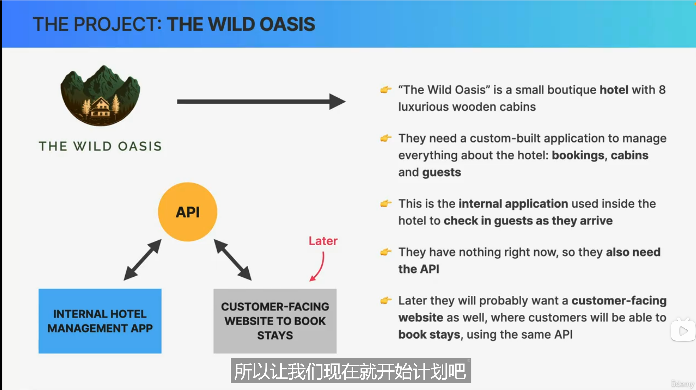
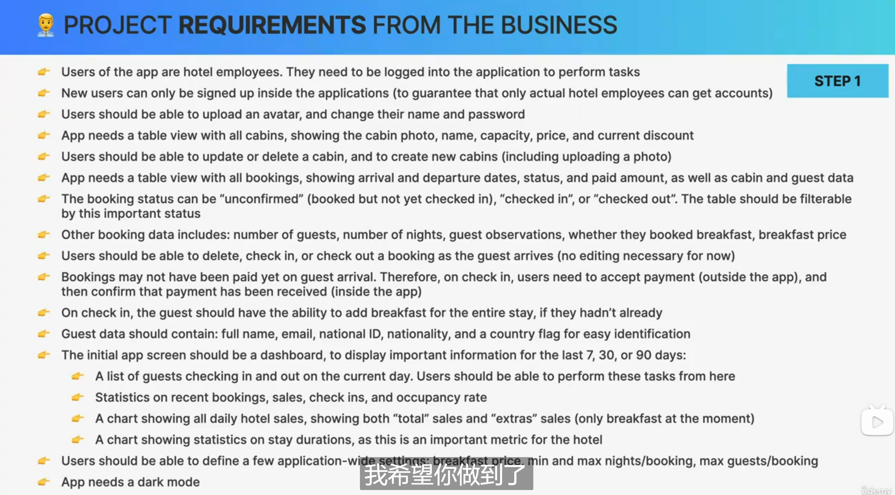
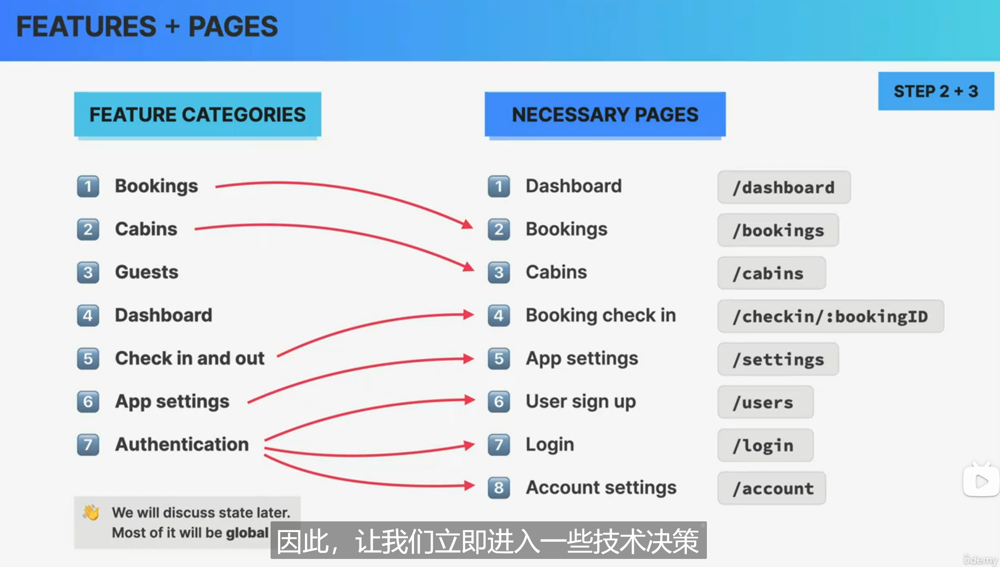
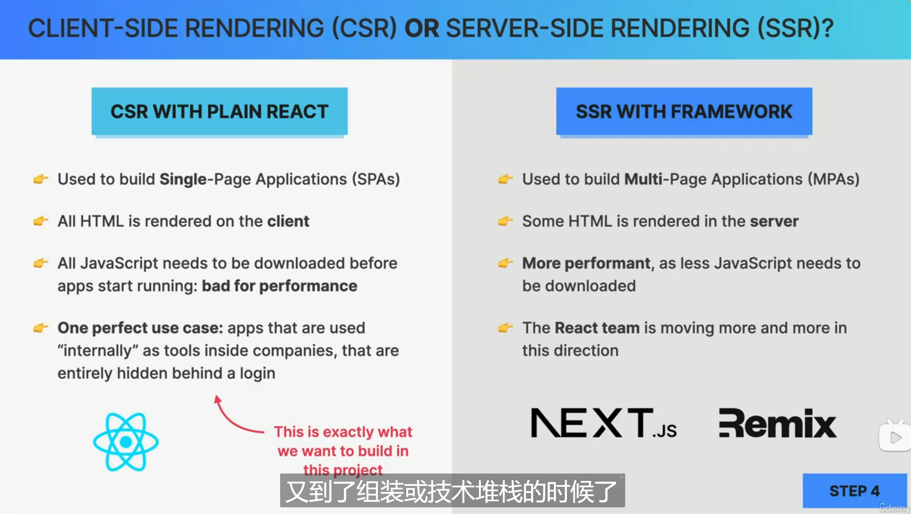
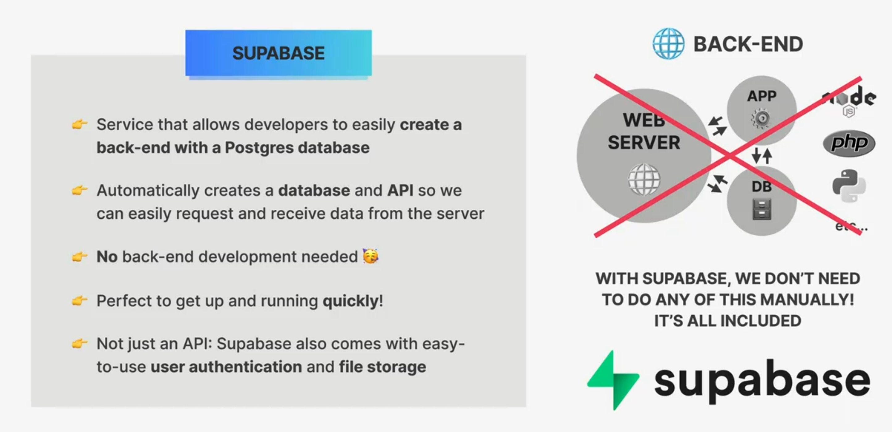
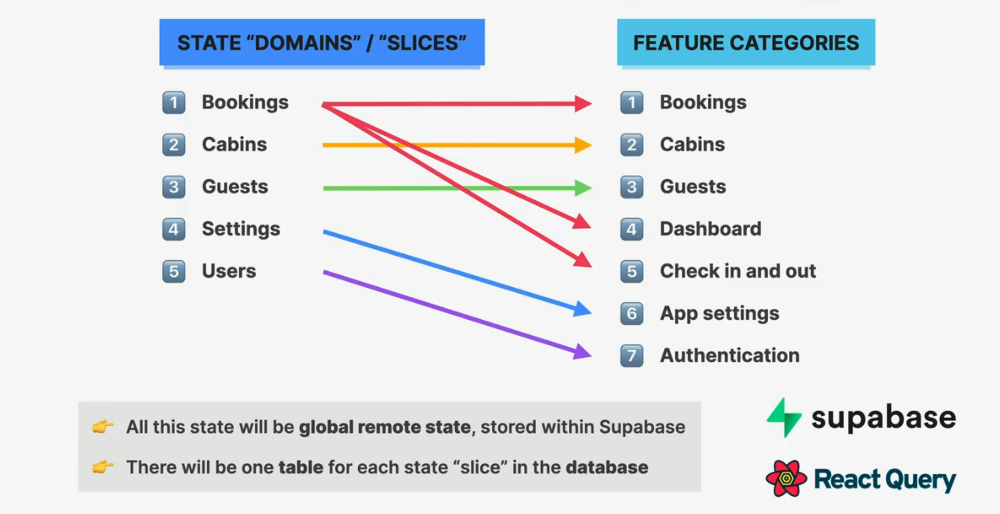
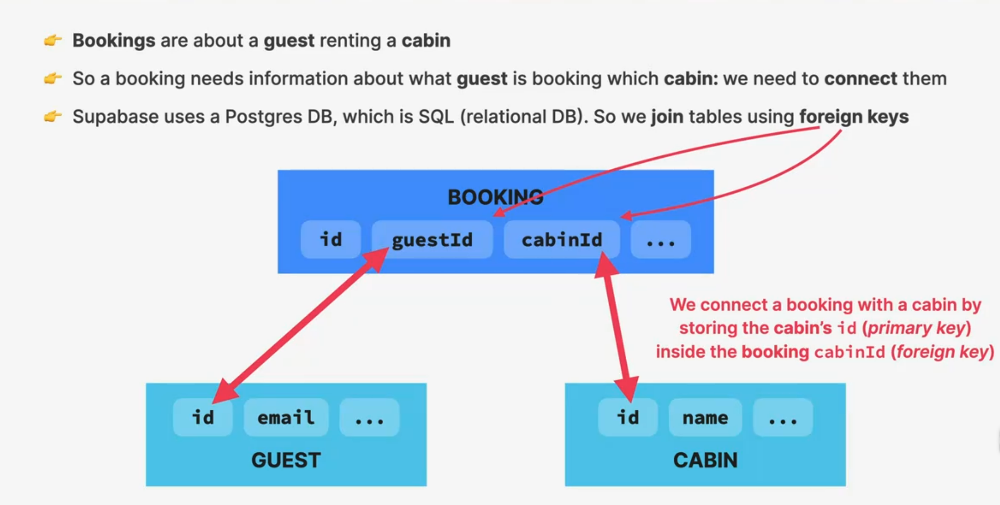
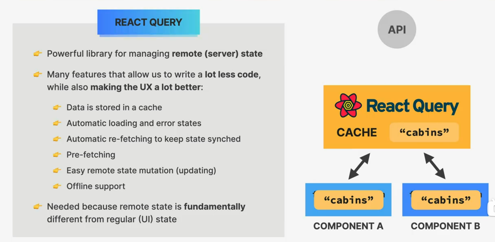
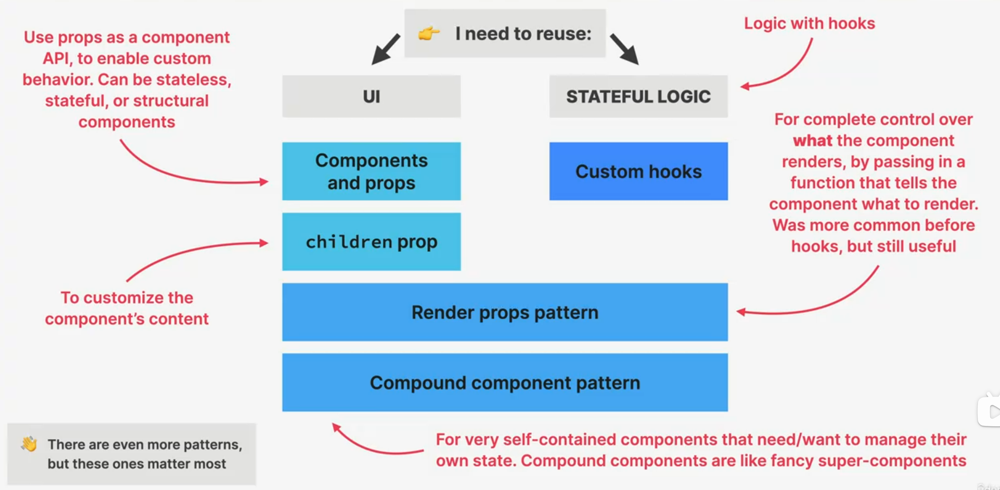

# SECTION-15

## THE PROJECT: THE WILD OASIS



## REVIEW: HOW TO PLAN A REACT APPLICATION

1. Gather application **requirements and feature**
2. Divide the application into **pages**
3. Divide the application into **feature categories**
4. Decide on what **libraries** to use (technology decisions)

## PROJECT REQUIREMENTS FROM THE BUSINESS




## FEATURES + PAGES



## CLIENT-SIDE RENDERING (CSR) OR SERVER-SIDE RENDERING (SSR)?



## WHAT IS SUPABASE?



## MODELING STATE



## THE BOOKING TABLE



## WHAT IS REACT QUERY?



## HOW TO REUSE CODE IN REACT?



## Higher-Order Component (HOC)

### What is a Higher-Order Component (HOC)?

A Higher-Order Component (HOC) is a pattern in React that allows you to reuse component logic. Specifically, an HOC is a function that takes a component as an argument and returns a new component. The returned component usually has some added functionality or behavior.

HOCs are commonly used for:

- **Code Reusability**: To share common logic between components.
- **Cross-Cutting Concerns**: To manage things like state, props manipulation, or side effects.
- **Enhancing Components**: Adding additional props or behaviors to components.

`withToggles.jsx`

```jsx
import { useState } from "react";

export default function withToggles(WrappedComponent) {
  return function List(props) {
    const [isOpen, setIsOpen] = useState(true);
    const [isCollapsed, setIsCollapsed] = useState(false);

    const displayItems = isCollapsed ? props.items.slice(0, 3) : props.items;

    function toggleOpen() {
      setIsOpen((isOpen) => !isOpen);
      setIsCollapsed(false);
    }

    return (
      <div className="list-container">
        <div className="heading">
          <h2>{props.title}</h2>
          <button onClick={toggleOpen}>
            {isOpen ? <span>&or;</span> : <span>&and;</span>}
          </button>
        </div>
        {isOpen && <WrappedComponent {...props} items={displayItems} />}

        <button onClick={() => setIsCollapsed((isCollapsed) => !isCollapsed)}>
          {isCollapsed ? `Show all ${props.items.length}` : "Show less"}
        </button>
      </div>
    );
  };
}
```

### USAGE:

```jsx
function ItemList({ items }) {
  return (
    <ul>
      {items.map((item, index) => (
        <li key={index}>{item}</li>
      ))}
    </ul>
  );
}

const TogglingItemList = withToggles(ItemList);

// In App.jsx
<TogglingItemList title="..." items={...} />;
```

## THE COMPOUND COMPONENT PATTERN

```jsx
// 1. Create a context
const CounterContext = createContext();

// 2. Create parent component
function Counter({ children }) {
  const [count, setCount] = useState(0);
  const increase = () => setCount((c) => c + 1);
  const decrease = () => setCount((c) => c - 1);

  return (
    <CounterContext.Provider value={{ count, increase, decrease }}>
      <span>{children}</span>
    </CounterContext.Provider>
  );
}

// 3. Create child components to help implementing the common task
function Count() {
  const { count } = useContext(CounterContext);
  return <span>{count}</span>;
}

function Label({ children }) {
  return <span>{children}</span>;
}

function Increase({ icon }) {
  const { increase } = useContext(CounterContext);
  return <button onClick={increase}>{icon}</button>;
}

function Decrease({ icon }) {
  const { decrease } = useContext(CounterContext);
  return <button onClick={decrease}>{icon}</button>;
}

// 4. Add child components as properties to parent component
Counter.Count = Count;
Counter.Label = Label;
Counter.Increase = Increase;
Counter.Decrease = Decrease;

export default Counter;
```
