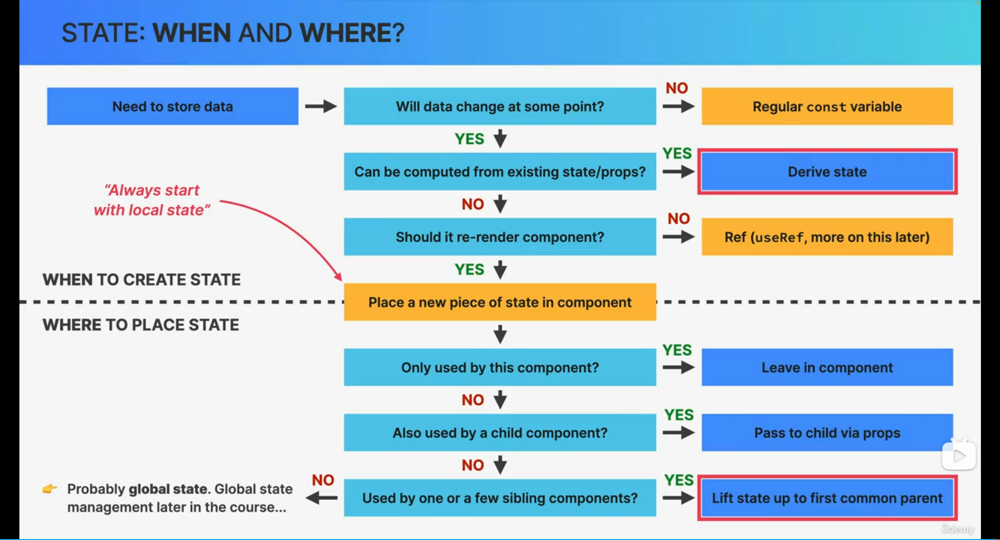

# Section-3&4 Travel List

## Section 3

### STATE VS. PROPS

- **STATE**

  - 👉 **Internal** data, owned by component
  - 👉 Component "memory"
  - 👉 Can be updated by the component itself
  - 👉 Updating state causes component to re-render
  - 👉 Used to make components interactive

- **PROPS**
  - 👉 **External** data, owned by parent component
  - 👉 Similar to function parameters
  - 👉 Read-only
  - 👉 **Receiving new props causes component to re-render**.
    Usually when the parent's state has been updated
  - 👉 Used by parent to configure child component ("settings")

## Section 4

### REACT DEVELOPER CORE SKILLS

- 👉 **Thinking** in React
- 👉 **State** management
- 👉 **When** and **where** to create state?
- 👉 **Derived** state
- 👉 **Lifting** up state

- "**THINKING** IN REACT" IS A CORE SKILL

  > **HOW TO WORK WITH REACT API**
  > This is where professional React apps are built(between the both of two)
  > **THINKING IN REACT**

  - 👉 **"React Mindset"**
  - 👉 Thinking about components, state, data flow, effects, etc.
  - 👉 Thinking in **state transitions,** not element mutations

- "THINKING IN REACT" AS A **PROCESS** _Not a rigid process_

  - **THE "THINKING IN REACT" PROCESS**

    1. Break the desired UI into **components** and establish the **component tree**
    2. Build a **static** version in React(without state)

    > 3&4 _State management_

    3. Think about **state:**

    - 👉 When to use state
    - 👉 Types of state: local vs. global
    - 👉 Where to place each piece of state

    4. Establish **data flow:**

    - 👉 One-way data flow
    - 👉 Child-to-parent communication
    - 👉 Accessing global state

**WHEN YOU KNOW HOW TO "THINKING IN REACT", YOU WILL BE ABLE TO ANSWER:**

- 🤔 How to break up a UI design into components?
- 🤔 How to break up a Ul design into components?
- 🤔 How to make some components reusable?
- 🤔 How to assemble Ul from reusable components?
- 🤔 What pieces of state do lneed for interactivity?
- 🤔 Where to place state? (What component should "own" each piece of state?)
- 🤔 What types of state can or should l use?
- 🤔 How to make data flow through app?

### WHAT IS STATE MANAGEMENT?

👉 **State management:** Deciding **when** to create pieces of state, what types of state are necessary, **where** to place each piece of state, and how data **flows** through the app

looks as 🏠 Giving each piece of state a **home**

### TYPES OF STATE: LOCAL VS. GLOBAL STATE

- **Local state:**

  - 👉 State needed **only by one or a few components**

  - 👉 State that is defined in a component and **only that component and child components** have access to it(by passing via props)
  - ☝️ **_We should always start with local state_**

- **Global state:**

  - 👉 State that **many components** might need
  - 👉 **Shared** state that is accessible to **every component** in the entire application
    Context API & Redux

### STATE: WHEN AND WHERE?

