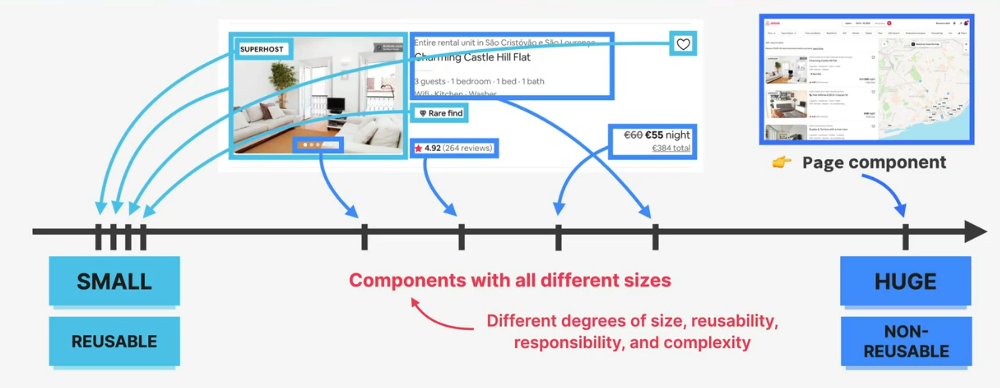
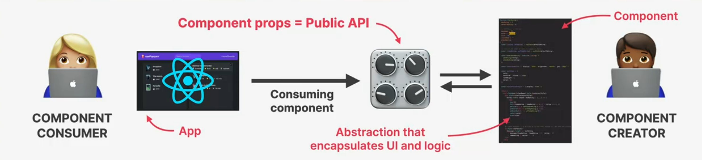

# Section 5 Components & Layouts

## COMPONENT SIZE MATTERS

>        COMPONENT SIZE
>
> ----------------------------->
> SMALL-----Generally-----HUGE

- on SMALL

  - 👉 We end up with 100s of mini-components
  - 👉 Confusing codebase
  - 👉 Too **abstracted**(_meaning: Creating something new to hide the implementation details of that thing_)

- on HUGE

  - 👉 Too many **responsibilities**
  - 👉 Might need too many **props**
  - 👉 Hard to **reuse**
  - 👉 Complex code, hard to understand

## HOW TO SPLIT A UI INTO COMPONENTS

**👉 The 4 criteria for splitting a UI into components:**

1. Logical separation of content/layout
2. Reusability
3. Responsibilities / complexity
4. Personal coding style

## FRAMEWORK: WHEN TO CREATE A NEW COMPONENT

> 💡 **SUGGESTION:** When in doubt, start with a relatively big component, then split it into smaller components as it becomes necessary
> ⬇️⬇️⬇️⬇️⬇️⬇️⬇️⬇️⬇️⬇️
> Skip if you're sure you need to reuse. But otherwise, you don't need to focus on reusability and and complexity early on

1. Logical separation of content/layout

- 👉 Does the component contain pieces of content or layout that **don't belong together**?

2. Reusability

- 👉 Is it possible to reuse part of the component?
- 👉 Do you **want** or **need** to reuse it?

3. Responsibilities / complexity

- 👉 Is the component doing too **many different things**?
- 👉 Does the component rely on too **many props**?
- 👉 Does the component have too **many pieces of state** and/or effects?
- 👉 Is the code, including JSX, too **complex/confusing**?

4. Personal coding style

- 👉 Do you prefer **smaller** functions/components?

All that means..

**_You might need a new component_**

## SOME MORE GENERAL GUIDELINES

- 💰 Be aware that creating a new component **creates a new abstraction**. Abstractions have a **cost**, because **more abstractions require more mental energy** to switch back and forth between components. So try not to create new components too early

- 🏷️ Name a component according to **what it does** or **what it displays**. Don't be afraid of using long component names

- 🪆 Never declare a new component **inside another component**!

- 🗃️ **Co-locate related components inside the same file**. Don't separate components into different files too early

- ↔️ It's completely normal that an app has components of **many different sizes**, including very small and huge ones (See next slide...👉)

## ANY APP HAS COMPONENTS OF DIFFERENT SIZES AND REUSABLITY



- 👉 **Some very small components are necessary!**
- 👉 Highly reusable
- 👉 Very low complexity
- 👉 **Most apps will have a few huge components**
- 👉 Not meant to be reused **(not a problem!)**

## COMPONENT CATEGORIES

- 👉 Most of your components will **naturally** fall into **one of three categories:**

  - **Stateless / presentational components**

    - 👉 **No state**
    - 👉 Can receive props and simply _present_ received data or other content
    - 👉 Usually **small and reusable**
    - Such as: _Logo_, _NumResults_, _Movie_

  - **Stateful components**

    - 👉 **Have state**
    - 👉 Can still be **reusable**
    - Such as: _Search_, _MovieList_

  - **Structural components**

    - 👉 **"Pages"**, **"layouts"**, or **"screens"** of the app
    - 👉 Result of **composition**
    - 👉 Can be **huge and nonreusable** (but don't have to)

## WHAT IS COMPONENT COMPOSITION?

- **"USEING" A COMPONENT**

```jsx
function Modal() {
  return (
    <div className="modal">
      <Success />
    </div>
  );
}

function Success() {
  return <p>Well done!</p>;
}
```

👉 **Success is _inside_ Modal: we can NOT reuse Modal**

- COMPONENT COMPOSITION

```jsx
function Modal({ children }) {
  return <div className="modal">{children}</div>;
}

<Modal>
  <Success />
</Modal>

<Modal>
  <Error />
</Modal>
```

👉 **Success is _passed into_ Modal: we can REUSE Modal**

> Possible because components don't need to know their children in advance

👉 **Component composition:** combining different components using the **children** prop (or explicitly defined props)

**WE COMPONENT COMPOSITION, WE CAN:**

1. Create highly reusable and flexible components
2. Fix prop drilling (great for layouts)

## PORPS AS AN API



> --|-------------------------------|--->
> TOO LITTLE PROPS---------TOO MANY PROPS
>
> We need to find the right balance between too little and too many props, that > works for both the consumer and the creator

- TOO LITTLE PROPS

  - 👉 Not **flexible** enough
  - 👉 Might not be **useful**

- TOO MANY PROPS
  - 👉 Too **hard** to use
  - 👉 Exposing too much **complexity**
  - 👉 **Hard-to-write** code
  - 👉 Provide good **default values**
