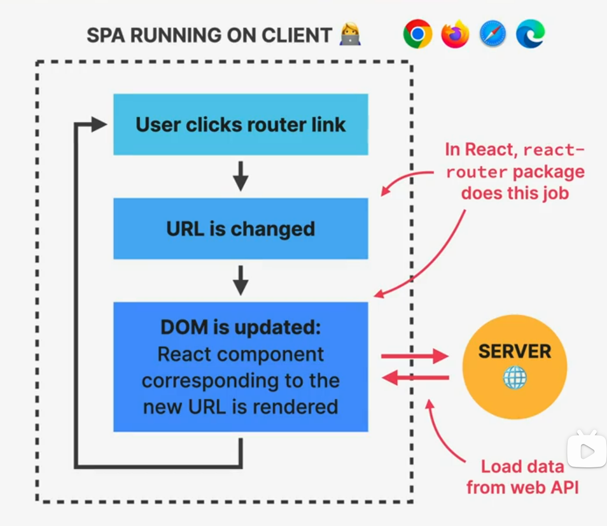
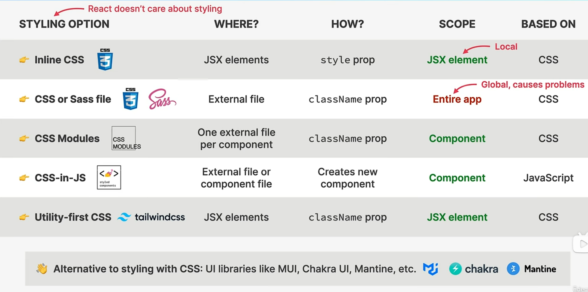
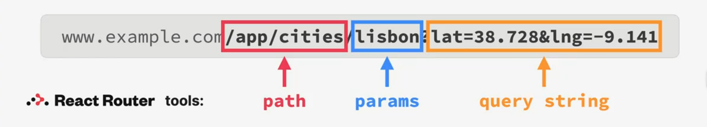

# SECTION-10 REACT-ROUTER: BUILDING SINGLE-PAGE APPLICATIONS

## WHAT IS ROUTING?

### ROUTING "Client-side routing"

- 👉 With routing, we match **different URLs** to **different UI views** (React components): **routes**
- 👉 This enables users to **navigate between different applications screens**, using the browser URL
- 👉 Keeps the UI **in sync** with the current browser **URL**
- 👉 Allows us to build **Single-Page Applications**

> third-party libarary --> React-Router

## SINGLE-PAGE APPLICATIONS(SPA)

### SINGLE-PAGE APPLICATION

- 👉 Application that is **executed entirely on the client**(browsers)
- 👉 **Routes**: different URLs correspond to different views (components)
- 👉 **JavaScript** (React) is used to update the page (DOM)
- 👉 **_The page is never reloaded_**
- 👉 Feels like a **native app**
- 👉 Additional data **might be loaded** from a web API

## STYLING OPTIONS IN REACT

## THE URL FOR STATE MANAGEMENT

> 👉 The URL is an excellent place to store UI state and an alternative to useState in some situations!
> **Examples**: open/close panels, currently selected list item, list sorting order, applied list filters

1. Easy way to store state in a **global place**, accessible to **all components** in the app
2. Good way to **"pass" data** from one page into the next page
3. Make it possible to **bookmark and share** the page with the exact UI state it had at the time

### EXAMPLE: PARAMS AND QUERY STRING

`www.example.com**/app/cities/lisbon?lat=38.728&lng=-9.141**`

👉 **City name** and **GPS location** were retrieve from the **URL** instead of application state!

`www.example.com**/app/cities/berlin?lat=52.536&lng=13.377**`
