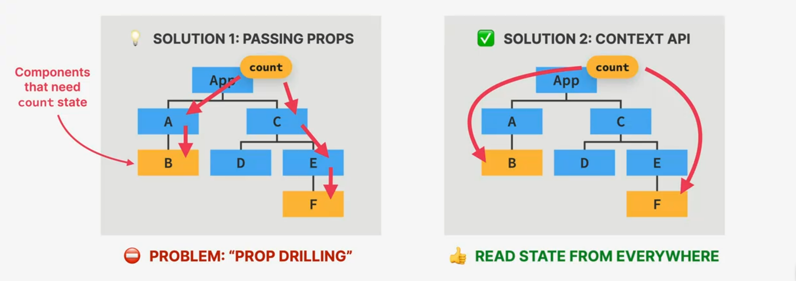
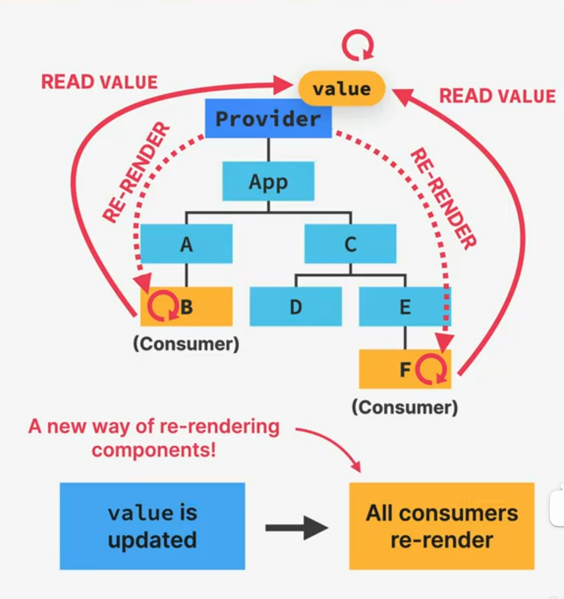
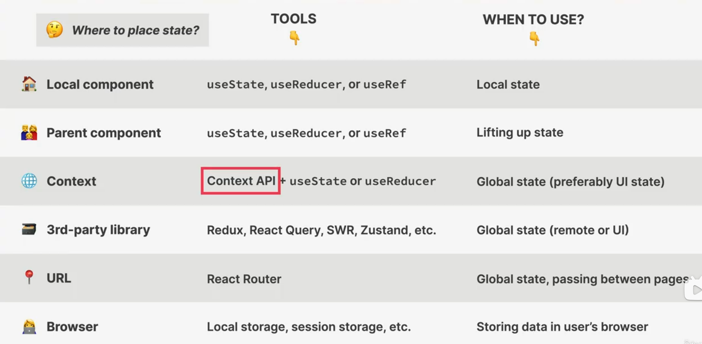
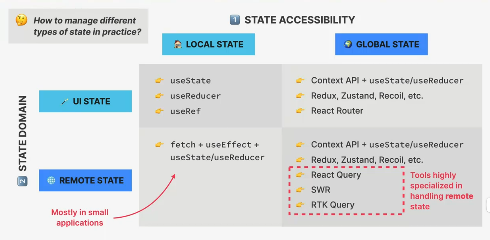

# SECTION-11 ADVANCED STATE MANAGEMENT: THE CONTEXT API

## A SOLUTION TO PROP DRILLING

> **👉 TASK: Passing state into multiple deeply nested child components**

> 👋 Remember that a good solution to "prop drilling" is **better component composition** (see "Thinking in React" section)

## WHAT IS THE CONTEXT API?

### CONTEXT API

- 👉 System to pass data throughout the app **without manually passing props** down the tree
- 👉 Allows us to **"broadcast" global state** to the entire app

1. **Provider**: gives all child components access to `value`
2. **`value`**: data that we want to make available (usually state and functions)
3. **Consumers**: all components that read the provided context `value`

## TYPES OF STATE

1. **STATE ACCESSIBILITY**
   > "If this component was rendered **twice**, should a state update in one of them reflect in the other one? _--If not, choose Local State_"
   - 🏠 **LOCAL STATE**
     - 👉 Needed only by **one or few components**
     - 👉 Only accessible in **component and child components**
   - 🌍 **GLOBAL STATE**
     - 👉 Might be needed by **many components**
     - 👉 Accessible to **every component** in the appication
2. **STATE DOMAIN**
   - 🌐 **REMOTE STATE**
     - 👉 All application data **loaded from a remote server**(API)
     - 👉 Usually **asynchronous**
     - 👉 Needs re-fetching + updating
   - 🪄 **UI STATE**
     - 👉 **Everything else** 😅
     - 👉 Theme, list filters, form data, etc.
     - 👉 Usually **synchronous** and stored in the application

## STATE PLACEMENT OPTIONS

## STATE MANAGEMENT TOOL OPTIONS

